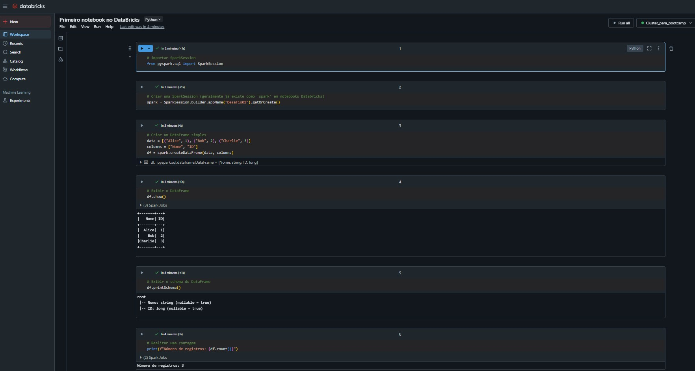

# Desafio 01 - Fundamentos do Azure Databricks

## 📋 Descrição
Primeiro desafio do bootcamp, voltado para os fundamentos do Azure Databricks. O objetivo é criar uma conta na plataforma (Community Edition), acessar a interface, e executar um notebook básico com comandos PySpark.

## 🎯 Objetivos
- [x] Criar conta no Azure Databricks Community Edition
- [x] Executar o primeiro notebook
- [x] Compreender o funcionamento básico dos clusters

## 🛠️ Tecnologias Utilizadas
- Azure Databricks (Community Edition)
- PySpark
- Python 3.x

## 🚀 Como Executar

### Pré-requisitos
- Navegador Web
- Conta na plataforma Azure Databricks (Community Edition)

### Execução
1. Acesse: https://community.cloud.databricks.com/
2. Crie um novo notebook.
3. Configure um cluster.
4. Execute comandos básicos em PySpark.

### Passo a Passo Detalhado

#### 1. Criando um Novo Notebook
   - Após fazer login no [Databricks Community Edition](https://community.cloud.databricks.com/), no menu lateral esquerdo, clique em **Workspace**.
   - No seu workspace (geralmente em *Users* > *seu_email@provedor.com*), clique com o botão direito ou no ícone de três pontos ao lado do seu nome de usuário.
   - Selecione **Create** > **Notebook**.
   - Dê um nome ao seu notebook (por exemplo, `Desafio01_PySpark_Basico`).
   - Selecione **Python** como a linguagem padrão.
   - Em **Cluster**, você verá a opção para selecionar um cluster existente ou criar um novo. Se você ainda não tem um, precisará criar.

#### 2. Configurando um Cluster
   - Se você não anexou um cluster ao criar o notebook, ou se precisa criar um novo:
   - No canto superior direito do notebook, clique onde diz **Connect** ou no nome de um cluster (se já houver um selecionado).
   - Se nenhum cluster estiver disponível ou se quiser criar um novo, clique em **Create new resource** ou **Create Compute**.
   - Dê um nome ao seu cluster (por exemplo, `MeuClusterCommunity`).
   - Para a Community Edition, as opções de configuração são limitadas, mas geralmente o Databricks Runtime Version já vem pré-selecionado. Mantenha as configurações padrão.
   - Clique em **Create Cluster**. Aguarde alguns minutos para que o cluster seja iniciado (o status mudará de *Pending* para *Running*).
   - Uma vez que o cluster esteja *Running*, ele será automaticamente anexado ao seu notebook, ou você poderá selecioná-lo na lista de clusters disponíveis no notebook.

#### 3. Executando Comandos Básicos em PySpark
   - Com o notebook aberto e o cluster anexado e em execução, você pode começar a escrever e executar código PySpark nas células.
   - **Exemplo de Comandos Básicos:**
     ```python
     # Importar SparkSession
     from pyspark.sql import SparkSession

     # Criar uma SparkSession (geralmente já existe como 'spark' em notebooks Databricks)
     spark = SparkSession.builder.appName("Desafio01").getOrCreate()

     # Criar um DataFrame simples
     data = [("Alice", 1), ("Bob", 2), ("Charlie", 3)]
     columns = ["Nome", "ID"]
     df = spark.createDataFrame(data, columns)

     # Exibir o DataFrame
     df.show()

     # Exibir o schema do DataFrame
     df.printSchema()

     # Realizar uma contagem
     print(f"Número de registros: {df.count()}")
     ```
   - Para executar uma célula, clique no ícone de "Play" (Executar Célula) ao lado da célula ou pressione `Shift + Enter`.

### 📊 Resultados
* Foi possível criar e executar comandos em um ambiente escalável baseado em Spark com facilidade e rapidez.



### 🔗 Links Úteis
* [Criar conta gratuita no Azure Databricks](https://community.cloud.databricks.com/)
* [Documentação oficial do Databricks](https://learn.microsoft.com/azure/databricks/)

### 📝 Notas
* A experiência com notebooks interativos em Databricks é fluida e bastante similar ao Jupyter, porém com integração nativa com clusters Spark.
