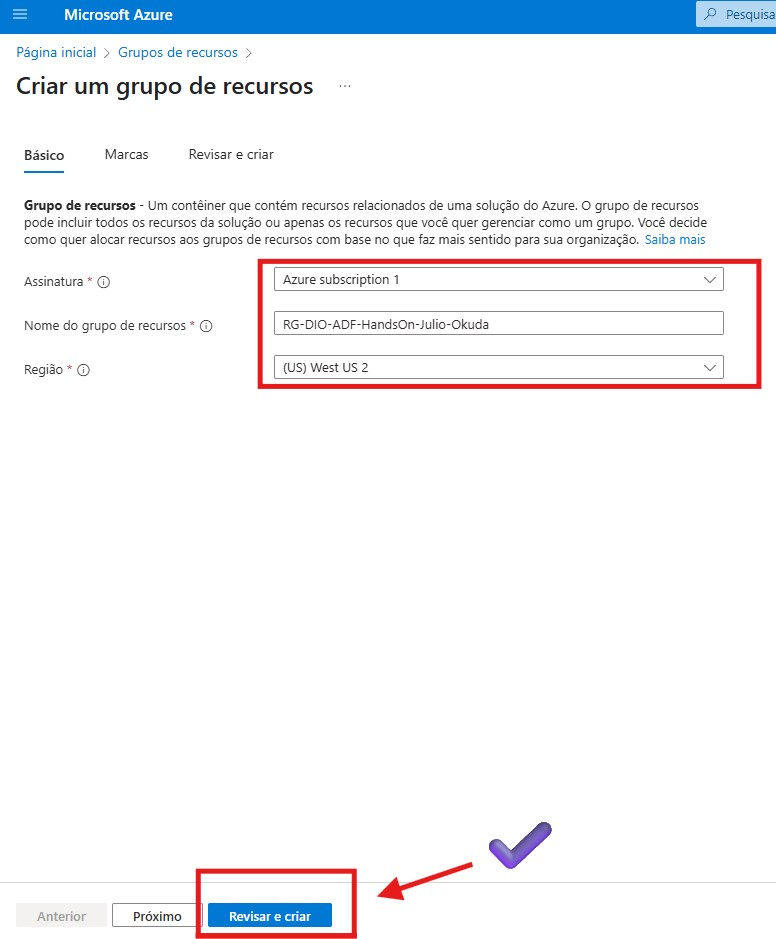
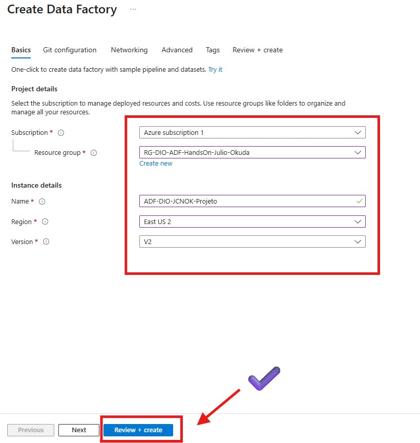
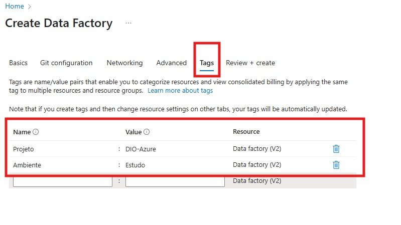
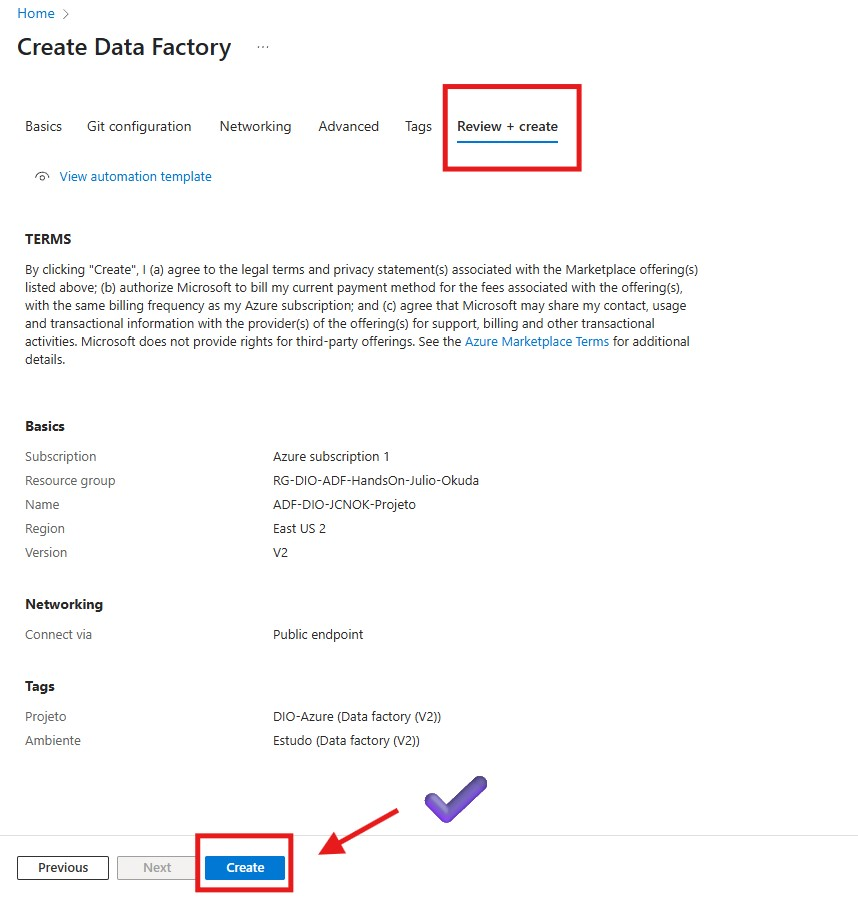
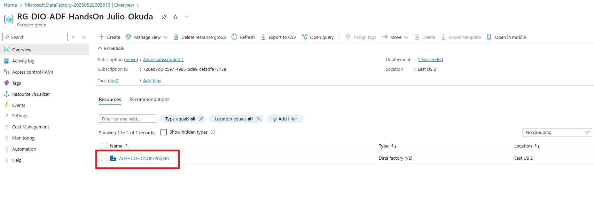
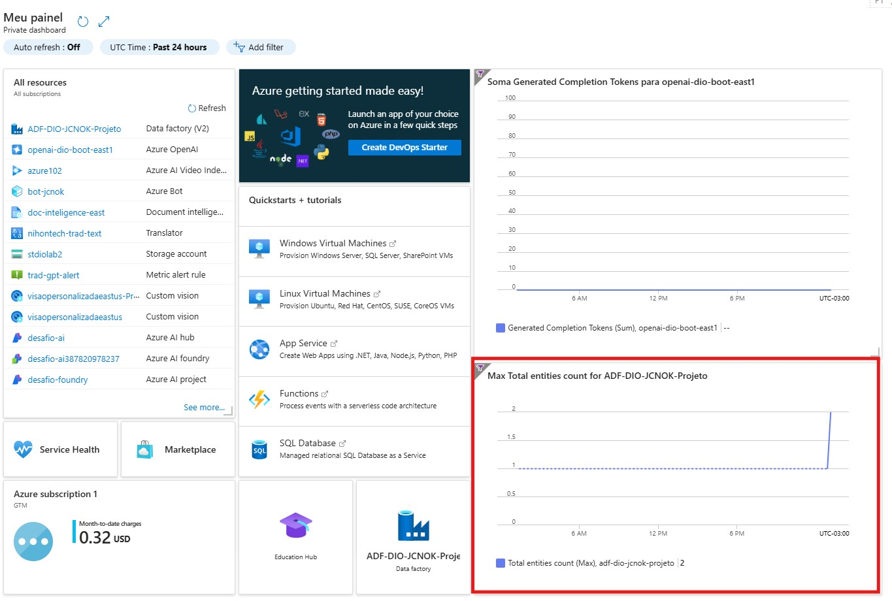
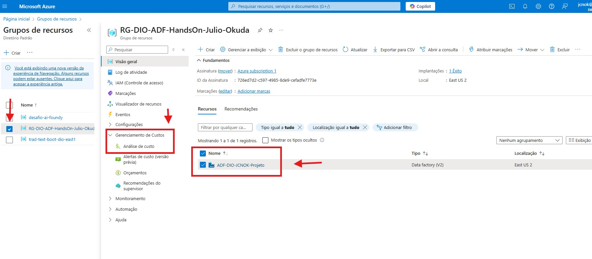
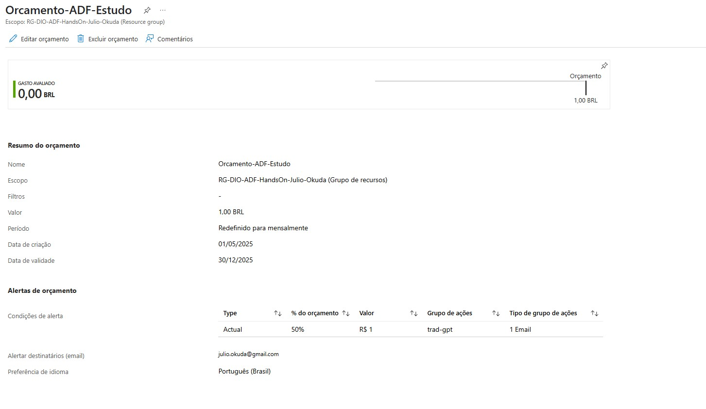

# Desafio 02 - Monitoramento de Custos no Data Factory 💰

## 📋 Descrição

Este projeto é um **hands-on prático e detalhado** da criação manual de um **Azure Data Factory (ADF)** no portal do Azure. O principal objetivo é replicar o processo de provisionamento do serviço, explorar suas configurações básicas e, crucialmente, configurar um **monitoramento de custos** para o recurso. Este desafio visa consolidar o aprendizado sobre a plataforma Azure e suas ferramentas de gestão de recursos e custos.

## 🎯 Objetivos

  - [x] Criar um **Grupo de Recursos** dedicado para o projeto.
  - [x] Provisionar uma instância do **Azure Data Factory (ADF)** via portal do Azure, configurando-o conforme as melhores práticas para estudo.
  - [x] Explorar a **Visão Geral** e as principais abas do ADF no portal.
  - [x] Personalizar o **Dashboard do Azure** fixando o recurso Data Factory para facilitar o acesso e monitoramento.
  - [x] Configurar um **monitoramento básico de custos** especificamente para o Data Factory, para acompanhar os gastos e evitar surpresas.

## 🛠️ Tecnologias Utilizadas

  - **Microsoft Azure:** Plataforma de nuvem.
      - **Azure Data Factory (ADF):** Serviço PaaS para orquestração e movimentação de dados.
      - **Grupos de Recursos:** Para organização lógica dos recursos.
      - **Azure Cost Management:** Para análise e monitoramento de custos.

-----

## 🚀 Configuração no Azure (Via Portal)

Vamos seguir um passo a passo bem detalhado para criar e configurar seu Azure Data Factory, incluindo as etapas de monitoramento de custos.

### Pré-requisitos

  - Uma **conta Microsoft Azure** ativa (a conta de estudante da DIO é perfeita\! 🎓).
  - Acesso ao **Portal do Azure**.

### Passo a Passo Detalhado:

#### **1. Acessar o Portal do Azure:**

  * Abra seu navegador e acesse [portal.azure.com](https://www.google.com/search?q=https://portal.azure.com/).
  * Faça login com sua conta Microsoft.
  
 
#### **2. Criar um Grupo de Recursos (Resource Group - RG):**

  * Na barra de pesquisa superior, digite `Grupos de recursos` e selecione a opção.
  * Clique em `+ Criar`.
  * **Na tela de "Criar um grupo de recursos":**
      * **Assinatura:** Selecione a sua assinatura (ex: "Assinatura do Azure para Estudantes").
      * **Região:** Escolha a região mais próxima de você ou a que preferir (ex: `Brazil South` ou `East US 2`).
      * **Nome do grupo de recursos:** Dê um nome significativo e único, como `RG-DIO-ADF-Custos-Julio-Okuda`. Isso ajuda na organização e no controle de custos futuros.
  * Clique em `Revisar + criar` e, em seguida, `Criar`.
  
  
#### **3. Criar o Azure Data Factory (ADF):**

  * Na barra de pesquisa, digite `Data Factory` e selecione "Data factories".
  * Clique em `+ Criar`.
  * **Preencha a aba "Básico":**
      * **Assinatura:** Confirme sua assinatura.
      * **Grupo de recursos:** Selecione o RG que você acabou de criar.
      * **Região:** Mantenha a mesma região do seu Grupo de Recursos.
      * **Nome:** Dê um nome **globalmente único** para o seu Data Factory (ex: `ADF-DIO-Monitor-JCNOK-Projeto`).
      * **Versão:** Mantenha `V2`.
      * Clique em `Próximo: Configuração do Git >`.
      
       
  * **Nas próximas abas, mantenha as opções padrão para este projeto:**
      * **Configuração do Git:** Selecione `Configurar o Git mais tarde`.
      * **Rede:** Mantenha `Ponto de extremidade público`.
      * **Avançado:** Mantenha as opções padrão.
  * **Aba "Marcas (Tags)":**
      * Adicione tags para organizar seu recurso e auxiliar no monitoramento de custos. Exemplo:
          * `Projeto`: `DIO-Monitoramento`
          * `Ambiente`: `Estudo`
          * `Owner`: `Julio Okuda`
      * Clique em `Próximo: Examinar + criar >`.
            
        
  * **Aba "Revisar + criar":**
      * Verifique se a `Validação aprovada` apareceu.
      * Clique em `Criar`.
       

#### **4. Acompanhar a Implantação e Acessar o Recurso:**

  * Aguarde a notificação de `Implantação bem-sucedida`.
  * Clique no botão `Ir para o recurso`.
  

#### **5. Explorar o Dashboard e Fixar o ADF:**

  * Na tela de "Visão Geral" do seu ADF, clique no ícone de `Fixar no painel` (parece um alfinete) na barra superior.
  * Vá para o seu **Dashboard** (clicando em "Dashboard" no menu lateral esquerdo).
     

#### **6. Configurar Monitoramento de Custos para o Data Factory:**

  * No menu do seu Data Factory (lado esquerdo), role para baixo até a seção **"Gerenciamento de custos"**.
  * Clique em **"Análise de custo"**.
      * Nesta tela, você pode visualizar os custos da sua assinatura. Para focar apenas no seu Data Factory:
          * Clique em `Adicionar filtro`.
          * Selecione `Recurso`.
          * Na lista, procure e selecione o **nome do seu Data Factory**.
          * Você verá um gráfico mostrando o custo do seu ADF (provavelmente baixo, pois é novo).
           
  * Agora, vamos criar um **alerta de custo** para o seu ADF:
      * Ainda na seção "Gerenciamento de custos" (do seu Data Factory), clique em **"Alertas de custo"**.
      * Clique em `+ Adicionar alerta`.
      * **Tipo de alerta:** Mantenha `Orçamento`.
      * **Nome do orçamento:** Dê um nome (ex: `Orcamento-ADF-Estudo`).
      * **Período de redefinição do orçamento:** `Mensal`.
      * **Data de criação:** Mantenha a data atual.
      * **Data de expiração:** Escolha uma data futura (ex: 6 meses a 1 ano).
      * **Valor do orçamento:** Defina um valor baixo para teste (ex: `R$ 5,00` ou `U$ 1,00`). Para um ADF ocioso, o custo tende a ser mínimo, mas isso é para simular.
      * Clique em `Avançar`.
      * **Condições de alerta:**
          * **Tipo de custo:** `Custo real`.
          * **Condição:** `Maior que`.
          * **Porcentagem do orçamento:** `50%` (isso significa que você será alertado quando atingir 50% do seu orçamento de R$ 5,00).
      * **Grupos de ação:**
          * Clique em `Gerenciar grupos de ação` para criar um novo grupo de ação (ou selecione um existente).
          * Clique em `+ Novo grupo de ação`.
          * **Nome do grupo de ação:** `GrupoAcao-Alerta-ADF`.
          * **Nome de exibição:** `Alerta ADF Estudo`.
          * **Guia Notificações:**
              * **Tipo de notificação:** `Email`.
              * **Nome:** `Email Admin`.
              * **Email/URI do Azure Resource Manager:** Coloque **seu endereço de e-mail**.
          * Clique em `Revisar + criar` e `Criar`.
          * Volte à tela de "Criar regra de alerta" e selecione o `GrupoAcao-Alerta-ADF` que você acabou de criar.
      * Clique em `Criar`.
      
      
-----

### 📊 Resultados

Este projeto me permitiu não apenas criar e configurar um Azure Data Factory manualmente, consolidando o aprendizado das aulas da DIO, mas também me capacitou a:

  * **Navegar e interagir eficientemente** com o Portal do Azure para provisionamento de recursos.
  * Entender a **estrutura e o propósito** dos Grupos de Recursos e das Tags para organização e gestão de custos.
  * Realizar os primeiros passos na **criação de um serviço PaaS** (Platform as a Service) como o Data Factory.
  * **Personalizar meu ambiente de trabalho** no Azure (Dashboard).
  * Configurar um **monitoramento de custos básico**, o que é fundamental para qualquer projeto em nuvem e demonstra preocupação com a otimização de gastos. Aprendi a visualizar os custos por recurso e a criar alertas para evitar surpresas no orçamento.

### 🔗 Links Úteis

  * [Documentação Oficial do Azure Data Factory](https://learn.microsoft.com/pt-br/azure/data-factory/)
  * [Visão Geral do Gerenciamento de Custos e Cobrança no Azure](https://learn.microsoft.com/pt-br/azure/cost-management-billing/cost-management-billing-overview)
  * [Digital Innovation One (DIO)](https://www.dio.me/)

### 📝 Notas

  * A experiência de criar os recursos manualmente pelo portal é excelente para entender o "porquê" de cada configuração. Em um ambiente de produção, a automação (como com ARM Templates ou Terraform) seria o próximo passo para garantir consistência e agilidade.
  * O monitoramento de custos é uma prática essencial para qualquer profissional de nuvem. Começar com alertas simples é um ótimo caminho para desenvolver essa habilidade.
  * A nomenclatura de recursos e o uso de tags são mais importantes do que parecem, impactando diretamente a organização e a análise de custos em ambientes maiores.

